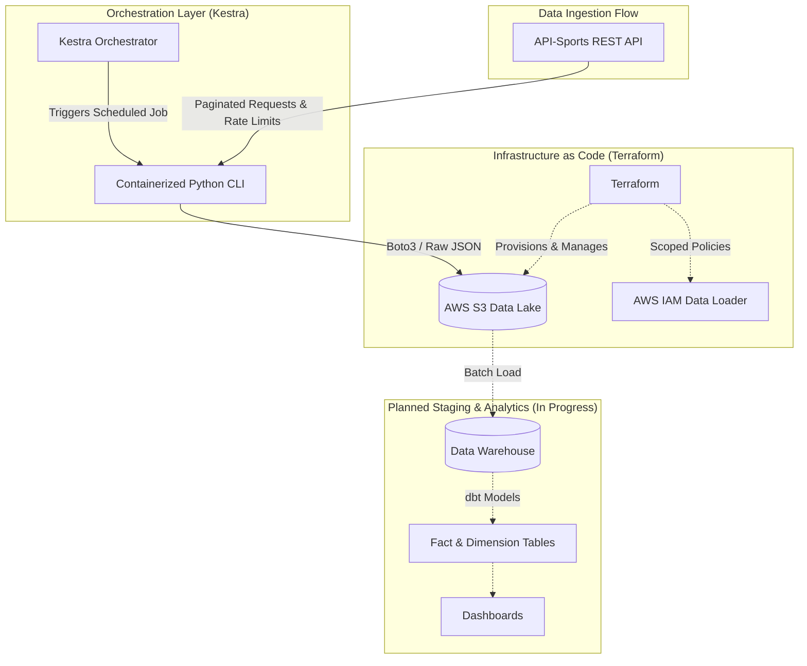

# ⚽ Football Data Pipeline (ELT)

[](https://www.python.org/)
[](https://docs.astral.sh/uv/)
[](https://www.terraform.io/)
[](https://aws.amazon.com/s3/)
[](https://kestra.io/)
[](#)

An end-to-end Data Engineering ELT pipeline designed to extract football sports statistics from API-Sports, store raw JSON payloads into an AWS S3 Data Lake, and automate batch execution workflows with Kestra.

>💡 Project Background:
>This project is inspired by the DataTalks.Club Data Engineering Zoomcamp, but completely re-engineered around a live external sports domain instead of the default NYC Taxi dataset.
>It features a custom CLI-based ingestion tool with pagination and API rate-limiting, optimized container packaging using Astral uv for fast dependency management executed under an unprivileged user, and fully automated cloud infrastructure provisioned via Terraform with remote S3 state storage and DynamoDB locking.

## 🏗 System Architecture



---

## ⚙️ Key Technical Features

* **Infrastructure as Code (IaC):** AWS S3 landing bucket and scoped IAM ingestion policies managed via **Terraform** (~> 6.0) with remote S3 backend state and DynamoDB state locking.
* **Resilient Ingestion Engine (`src/`):** Parameterized CLI built with `click` and `requests`. Features automated pagination, rate-limit sleep windows, dynamic S3 folder partitioning (`league_id / season / ingest_date`), and structured logging.
* **Orchestration Layer:** **Kestra 2.0** deployed as a standalone server backed by PostgreSQL 18 for pipeline scheduling and task execution.
* **Secure & Fast Containerization:** Multi-stage/lightweight Docker images leveraging Astral `uv` for sub-second dependency resolution, running under an unprivileged user (`ingest_user`) for container security.

---

## 📂 Repository Structure

```text
football-data-pipeline/
├── configs/             # YAML configurations for API endpoints and limits
├── terraform/           # IaC definitions (S3, IAM, State backend)
├── src/                 # Core Python source code (CLI app & utilities)
├── backups/             # Local database and state backups
├── compose.yaml         # Services orchestration (Kestra + Metadata DB)
├── Dockerfile           # Secure container build recipe (Python 3.13 + uv)
├── pyproject.toml       # Project metadata and dependencies
└── uv.lock              # Locked dependency tree
```

## 🛠 Tech Stack

| Domain | Tools / Technologies |
| :--- | :--- |
| **Language** | Python 3.13 |
| **Dependency Management** | Astral `uv` |
| **Cloud Storage** | AWS S3 |
| **Infrastructure as Code** | Terraform (AWS Provider ~> 6.0) |
| **Orchestration** | Kestra 2.0, PostgreSQL 18 |
| **Containerization** | Docker, Docker Compose |

---

## 🚀 Setup & Quickstart

### 1. Provision Infrastructure with Terraform
Navigate to the terraform directory to initialize and deploy the S3 Data Lake and IAM credentials:
```bash
cd terraform
terraform init
terraform plan -var="environment=dev"
terraform apply -var="environment=dev"
```

### 2. Configure Environment Variables
Create a .env file in the project root based on your credentials:

```.env
API_FOOTBALL_KEY=your_football_api_key

AWS_ACCESS_KEY_ID=your_aws_access_key_id
AWS_SECRET_ACCESS_KEY=your_aws_secret_access_key
AWS_DEFAULT_REGION=eu-central-1
AWS_S3_BUCKET_NAME=football-data-pipeline-landing-zone-dev

POSTGRES_USER=your_postgres_user_name
POSTGRES_PASSWORD=your_postgres_password
POSTGRES_DB=database_name

KESTRA_USER=valid_email
KESTRA_PASSWORD=your_kestra_password
```

### 3. Launch Orchestrator
Start Kestra and its PostgreSQL backend:
```bash
docker compose up -d
```

Access the Kestra Web UI at `http://localhost:8080`.

### 4. Run Manual Ingestion
You can test the ingestion engine directly using uv:
```bash
uv run python src/ingest.py --endpoint fixtures --league 39 --season 2024
```

Or run it inside the Docker container:
```bash
docker compose run --rm ingest-app --endpoint fixtures --league 39 --season 2024
```

---

## 📌 Project Roadmap

- [x] Cloud infrastructure as code with Terraform (S3, IAM, S3 Remote State & DynamoDB Lock)
- [x] Ingestion CLI engine with rate-limiting, pagination, and S3 partitioning
- [x] Secure Docker container build with Astral uv and non-root user execution
- [x] Kestra 2.0 orchestration deployment via Docker Compose
- [ ] End-to-end scheduled batch ingestion flows in Kestra
- [ ] Data Warehouse integration (ClickHouse or BigQuery)
- [ ] Data modeling and staging layer with dbt
- [ ] Interactive analytical dashboard (Metabase or Superset)
